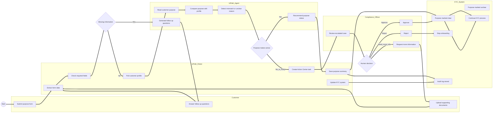

# BPMN Map

## AML KYC Understand Purpose BPMN Style Map

This file contains the BPMN style process map for the Understand Purpose stage using UiPath Robots, UiPath Agents, Compliance Officer review, and the KYC System.

## BPMN Mermaid Preview

## BPMN Process Explanation

1. The customer submits the purpose form.

2. UiPath Robot extracts the form data.

3. UiPath Robot checks whether required information is missing.

4. If information is missing, UiPath Agent generates follow up questions.

5. Customer answers the questions or uploads documents.

6. UiPath Robot pulls the customer profile.

7. UiPath Agent compares the stated purpose against the customer profile.

8. If the purpose is clear, the Robot saves the purpose summary and continues KYC.

9. If the purpose is unclear or risky, the Robot creates an Action Center task.

10. Compliance Officer reviews the case.

11. The case is approved, rejected, or sent back for more information.

12. The KYC System stores the final outcome and audit trail.
