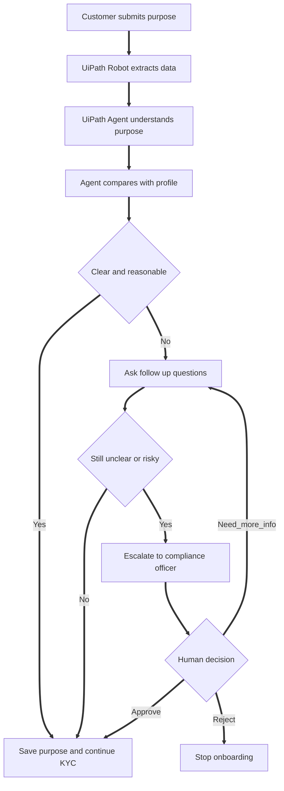
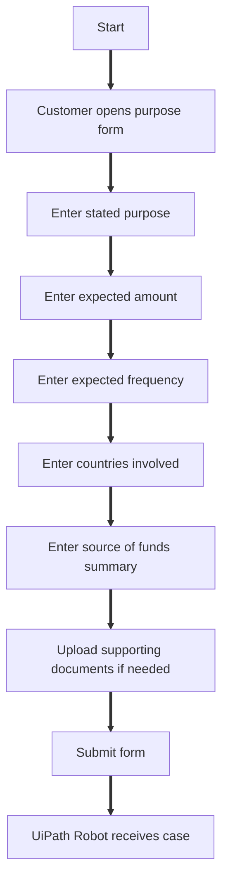
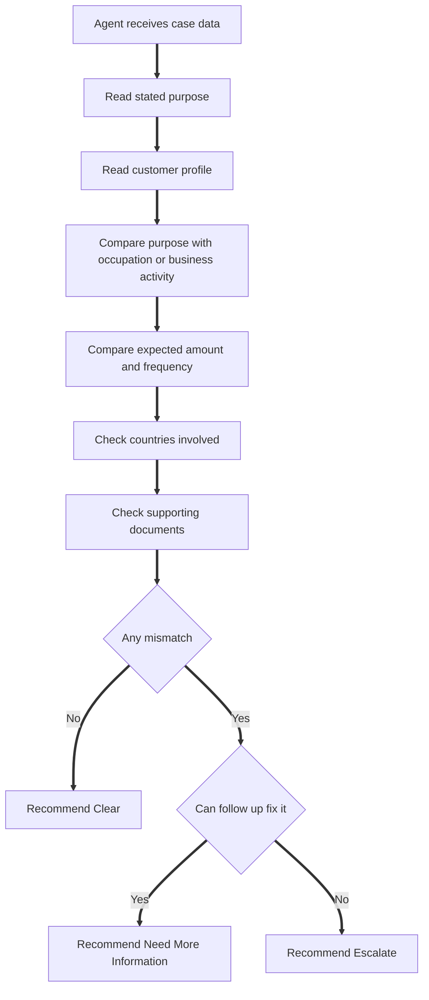
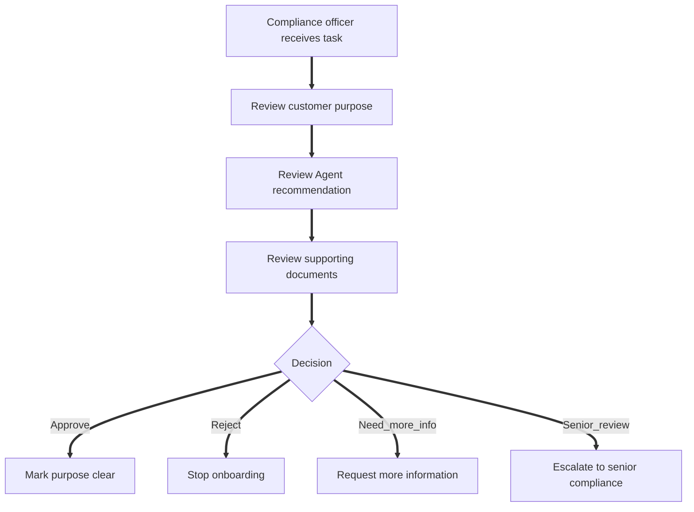
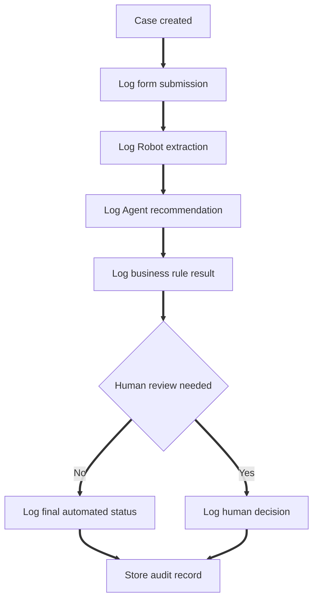

# Flowcharts

## Simple Understand Purpose Flowchart

```mermaid
flowchart TD
    A[Customer submits purpose] ==> B[UiPath Robot extracts data]
    B ==> C[UiPath Agent understands purpose]
    C ==> D[Agent compares with profile]
    D ==> E{Clear and reasonable}

    E == Yes ==> F[Save purpose and continue KYC]
    E == No ==> G[Ask follow up questions]

    G ==> H{Still unclear or risky}
    H == No ==> F
    H == Yes ==> I[Escalate to compliance officer]

    I ==> J{Human decision}
    J == Approve ==> F
    J == Reject ==> K[Stop onboarding]
    J == Need_more_info ==> G
```

## Customer Information Collection Flowchart

```mermaid
flowchart TD
    A[Start] ==> B[Customer opens purpose form]
    B ==> C[Enter stated purpose]
    C ==> D[Enter expected amount]
    D ==> E[Enter expected frequency]
    E ==> F[Enter countries involved]
    F ==> G[Enter source of funds summary]
    G ==> H[Upload supporting documents if needed]
    H ==> I[Submit form]
    I ==> J[UiPath Robot receives case]
```

## UiPath Agent Assessment Flowchart

```mermaid
flowchart TD
    A[Agent receives case data] ==> B[Read stated purpose]
    B ==> C[Read customer profile]
    C ==> D[Compare purpose with occupation or business activity]
    D ==> E[Compare expected amount and frequency]
    E ==> F[Check countries involved]
    F ==> G[Check supporting documents]
    G ==> H{Any mismatch}

    H == No ==> I[Recommend Clear]
    H == Yes ==> J{Can follow up fix it}

    J == Yes ==> K[Recommend Need More Information]
    J == No ==> L[Recommend Escalate]
```

## Human Review Flowchart

```mermaid
flowchart TD
    A[Compliance officer receives task] ==> B[Review customer purpose]
    B ==> C[Review Agent recommendation]
    C ==> D[Review supporting documents]
    D ==> E{Decision}

    E == Approve ==> F[Mark purpose clear]
    E == Reject ==> G[Stop onboarding]
    E == Need_more_info ==> H[Request more information]
    E == Senior_review ==> I[Escalate to senior compliance]
```

## Audit Trail Flowchart

```mermaid
flowchart TD
    A[Case created] ==> B[Log form submission]
    B ==> C[Log Robot extraction]
    C ==> D[Log Agent recommendation]
    D ==> E[Log business rule result]
    E ==> F{Human review needed}

    F == No ==> G[Log final automated status]
    F == Yes ==> H[Log human decision]

    G ==> I[Store audit record]
    H ==> I
```
