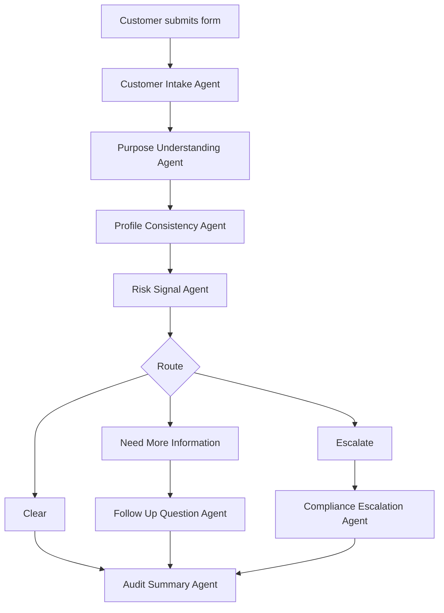

# TrustFlow Maestro Agent Documentation

## Project context

TrustFlow is a hackathon project for AML KYC onboarding.

The project focuses only on the Understand Purpose step.

The system helps check why a customer wants to use a service, whether the explanation makes sense, whether more information is needed, and whether the case should be escalated to a human compliance reviewer.

This is not a full AML system. The goal is to demonstrate a simple Maestro workflow with multiple agents.

Slogan: Trust made simple. Compliance made faster.

Design principle: Robot handles process. Agent handles reasoning. Human handles final risky decisions.

## Agent files

1. 00_Maestro_Orchestrator_Agent.md
2. 01_Customer_Intake_Agent.md
3. 02_Purpose_Understanding_Agent.md
4. 03_Profile_Consistency_Agent.md
5. 04_Risk_Signal_Agent.md
6. 05_Follow_Up_Question_Agent.md
7. 06_Compliance_Escalation_Agent.md
8. 07_Audit_Summary_Agent.md
9. 08_Demo_Case_Generator_Agent.md

## Recommended build order

1. Maestro Orchestrator Agent

2. Customer Intake Agent

3. Purpose Understanding Agent

4. Risk Signal Agent

5. Follow Up Question Agent

6. Compliance Escalation Agent

7. Audit Summary Agent

8. Demo Case Generator Agent

## Simple workflow

