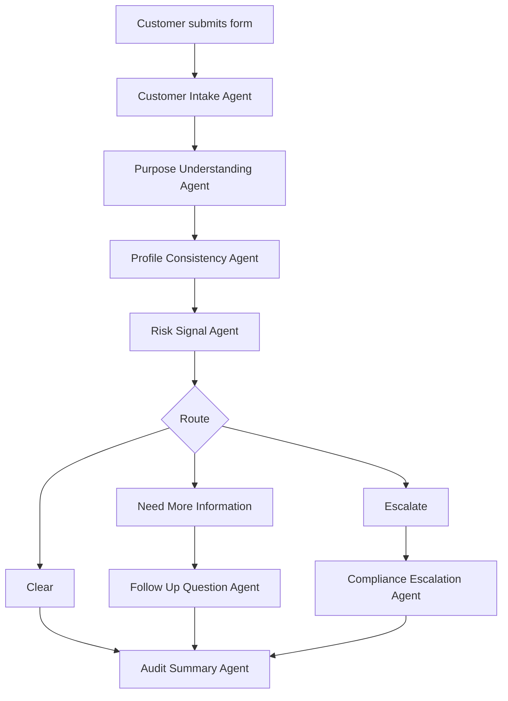
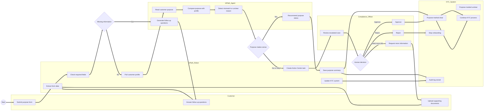
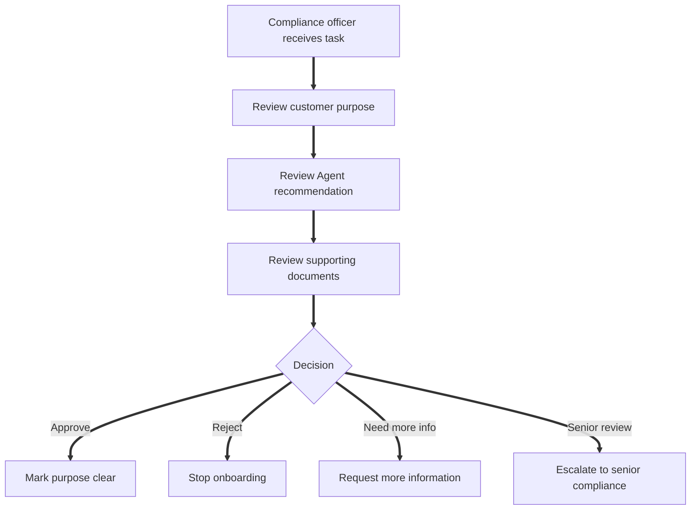
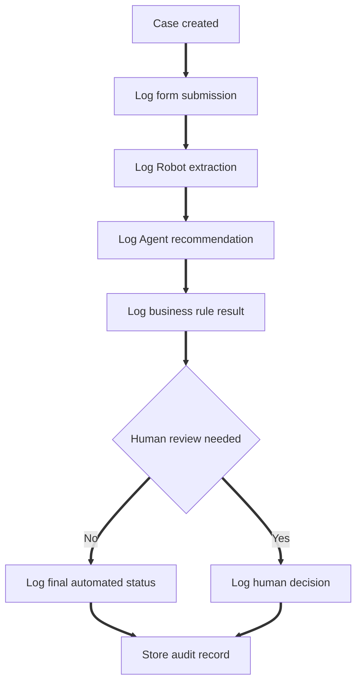

# Process and Diagrams

This file is the canonical place for TrustFlow workflow diagrams.

## Simple workflow

## BPMN-style process map

## Process explanation

1. Customer submits the purpose form.
2. UiPath Robot extracts form data and checks required fields.
3. If information is missing, the Agent generates follow up questions.
4. If fields are complete, the Robot pulls the customer profile.
5. The Agent compares stated purpose against the customer profile.
6. Clear cases continue KYC.
7. Incomplete cases ask the customer for more information.
8. Risky or unclear cases create a human review task.
9. The KYC system stores the final outcome and audit trail.

## Human review flow

## Audit trail flow

